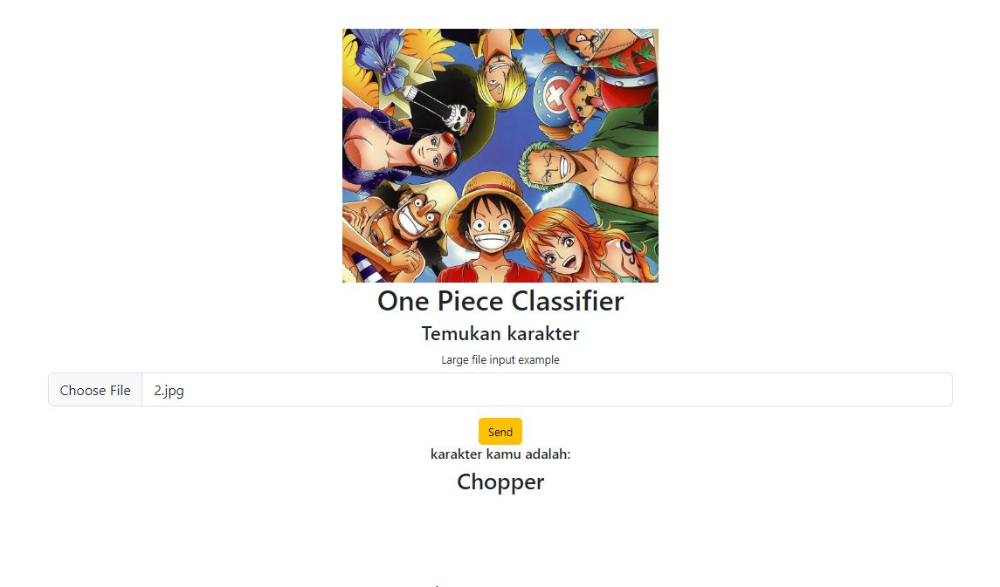

# machine-learning

## One Piece Classifier
- data diambil dari kaggle.com, 
- aplikasi yang digunakan pychram untuk pemograman machine learning menggunakan bahasa python, libary yang perlu kamu instal diantaranya: flask, flask-cors, pillow, numpy, tensorflow. 
- aplikasi untuk membuat tampilan web saya menggunakan visual studio code, dengan framework bootstrap sebagai tampilan webnya.

Pembelajaran ini untuk mendapatkan acuracy dari karakter one piece yang sudah diprogram dengan baik. Score curacy data pelatihannya mendapatkan skor tertinggi 76%, sudah cukup baik untuk pelatihan modelnya. 
